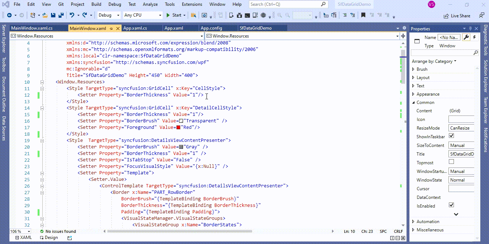

# How to hide the empty row and remove the border of TemplateViewDefinition in WPF DataGrid (SfDataGrid)?

## About the sample
This example illustrates how to hide the empty row and remove the border of TemplateViewDefinition in [WPF DataGrid](https://www.syncfusion.com/wpf-controls/datagrid) (SfDataGid)? 

[WPF DataGrid](https://www.syncfusion.com/wpf-controls/datagrid) (SfDataGrid) does not provide the direct support to hide the empty row and remove the border of [TemplateViewDefinition](https://help.syncfusion.com/cr/wpf/Syncfusion.UI.Xaml.Grid.TemplateViewDefinition.html). You can hide the empty row of [TemplateViewDefinition](https://help.syncfusion.com/cr/wpf/Syncfusion.UI.Xaml.Grid.TemplateViewDefinition.html) by customization the Loaded event and remove the border lines by write style for **BorderThickness** of [GridCell](https://help.syncfusion.com/cr/wpf/Syncfusion.UI.Xaml.Grid.GridCell.html) and [DetailsViewContentPresenter](https://help.syncfusion.com/cr/wpf/Syncfusion.UI.Xaml.Grid.DetailsViewContentPresenter.html). 

```XML

<Window.Resources>
        <Style TargetType="syncfusion:GridCell" x:Key="CellStyle">
            <Setter Property="BorderThickness" Value="0"/>
        </Style>
        <Style TargetType="syncfusion:GridCell" x:Key="DetailCellStyle">
            <Setter Property="BorderThickness" Value="0"/>
            <Setter Property="BorderBrush" Value="Transparent" />
            <Setter Property="Foreground" Value="Red"/>
        </Style>
        <Style  TargetType="syncfusion:DetailsViewContentPresenter">
            <Setter Property="BorderBrush" Value="Gray" />
            <Setter Property="BorderThickness" Value="0" />
            <Setter Property="IsTabStop" Value="False" />
            <Setter Property="FocusVisualStyle" Value="{x:Null}" />
            <Setter Property="Template">
                <Setter.Value>
                    <ControlTemplate TargetType="syncfusion:DetailsViewContentPresenter">
                        <Border x:Name="PART_RowBorder"
                            BorderBrush="{TemplateBinding BorderBrush}"
                            BorderThickness="{TemplateBinding BorderThickness}"
                            Padding="{TemplateBinding Padding}">
                            <VisualStateManager.VisualStateGroups>
                                <VisualStateGroup x:Name="BorderStates">
                                    <VisualState x:Name="NormalCell">
                                        <Storyboard BeginTime="0">
                                            <ThicknessAnimationUsingKeyFrames Storyboard.TargetName="PART_RowBorder" Storyboard.TargetProperty="(Border.BorderThickness)">
                                                <EasingThicknessKeyFrame KeyTime="0" Value="0,0,1,0" />
                                            </ThicknessAnimationUsingKeyFrames>
                                        </Storyboard>
                                    </VisualState>
                                    <VisualState x:Name="LastCell">
                                        <Storyboard BeginTime="0">
                                            <ThicknessAnimationUsingKeyFrames Storyboard.TargetName="PART_RowBorder" Storyboard.TargetProperty="(Border.BorderThickness)">
                                                <EasingThicknessKeyFrame KeyTime="0" Value="0,0,1,1" />
                                            </ThicknessAnimationUsingKeyFrames>
                                        </Storyboard>
                                    </VisualState>
                                </VisualStateGroup>
                            </VisualStateManager.VisualStateGroups>
                            <ContentPresenter />
                        </Border>
                    </ControlTemplate>
                </Setter.Value>
            </Setter>
        </Style>
        <local:StringToVisibilityConverter x:Key="StringToVisibilityConverter"/>
        <local:IntToVisibilityConverter x:Key="IntToVisibilityConverter"/>
</Window.Resources>

```

```C#

dataGrid.Loaded += DataGrid_Loaded;

private void DataGrid_Loaded(object sender, RoutedEventArgs e)
{
     //get the Generated items in SfDataGrid
     var  generatedRecords= dataGrid.RowGenerator.Items;

     foreach (var record in generatedRecords)
     {
           //check the record is DetailsViewDatarow
           if (record is DetailsViewDataRow)
           {
               //get the row data value of DetailsView
               var rowdata = (record as DetailsViewDataRow).RowData;
               //Get the record information 
               var data = (rowdata as RecordEntry).Data;

               var transactionModifiers = (data as OrderTransactionList).OrderTransaction.TransactionModifiers;
               //check the value
               if (transactionModifiers == null)
               {
                   //set the height to hide the TemplateViewDefinition
                   dataGrid.GetVisualContainer().RowHeights[record.RowIndex] = 0;
                   dataGrid.GetVisualContainer().InvalidateMeasure();
                }
           }
     }
}

```



Take a moment to peruse the [WPF DataGrid - Record Template View](https://help.syncfusion.com/wpf/datagrid/record-template-view) documentation, where you can find about conditional record template view with code examples.

KB article - [How to hide the empty row and remove the border of TemplateViewDefinition in WPF DataGrid (SfDataGrid)?](https://www.syncfusion.com/kb/12627/how-to-hide-the-empty-row-and-remove-the-border-of-templateviewdefinition-in-wpf-datagrid)

## Requirements to run the demo
Visual Studio 2015 and above versions
